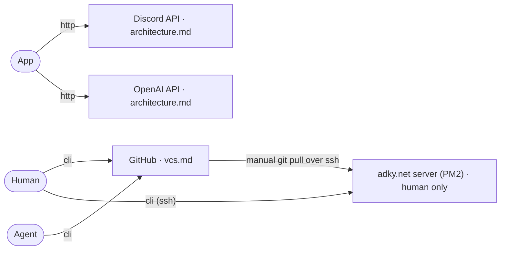

# Ecosystem

```mermaid
flowchart LR
  Human([Human])
  Agent([Agent])
  App([App])
  Vcs["GitHub · vcs.md"]
  Discord["Discord API · architecture.md"]
  OpenAI["OpenAI API · architecture.md"]
  Host["adky.net server (PM2) · human only"]

  Agent -- cli --> Vcs
  Human -- cli --> Vcs
  App -- http --> Discord
  App -- http --> OpenAI
  Human -- "cli (ssh)" --> Host

  Vcs -- "manual git pull over ssh" --> Host
```
